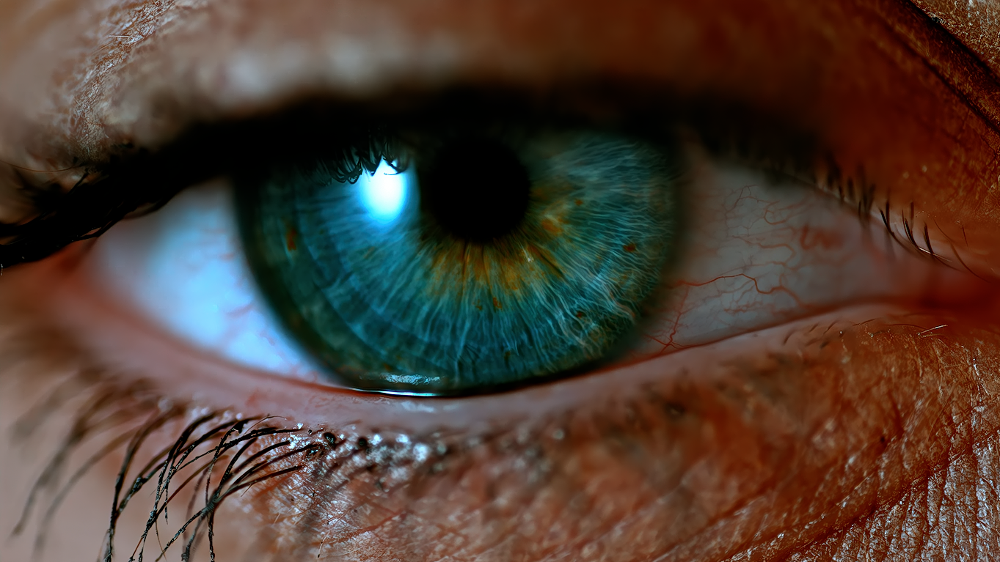
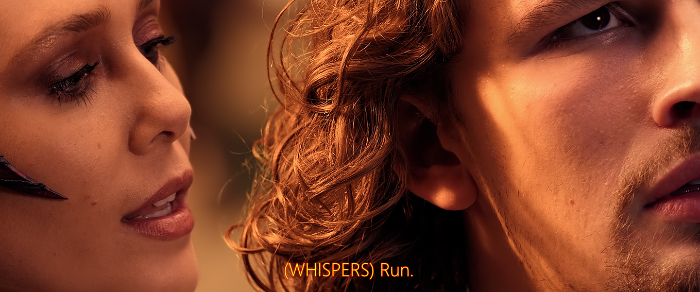

# Ulysses Caballes’ MPV Configuration  

A hand‑crafted cinema engine built for IMAX‑grade immersion. It pairs pristine video fidelity with spatially rich audio, adaptable to headphones and multi‑speaker arrays. Every shader, script, and profile is tuned for clarity, depth, and realism.  
    

## Core Components  

  
  
  
  
  
  
  
  

---

## Table of Contents
- [Overview](#overview)  
- [Features](#features)  
- [Requirements](#requirements)
- [Platform Performance Note](#platform-performance-note)  
- [Demo Clip](#demo-clip)  
- [Screenshots](#screenshots)  
- [Shader Pipeline](#shader-pipeline)  
- [Audio Pipeline](#audio-pipeline)  
- [Profiles](#profiles)  
- [Keyboard Function Shortcuts](#keyboard-function-shortcuts)  
- [Menu & Utility Shortcuts](#menu--utility-shortcuts)  
- [Script Suite](#script-suite)  
- [Datasets](#datasets)  
- [Installation](#installation)  
- [Usage Note](#usage-note)  
- [Common Toggles & Beginner Notes](#common-toggles--beginner-notes)  
- [Optional Add-ons](#optional-add-ons)  
- [Philosophy](#philosophy)  
- [Repo Hygiene](#repo-hygiene)  
- [Final Word](#final-word)  
- [License](#license)  

---

## Overview
This MPV configuration is engineered for viewers who demand cinematic fidelity, artifact‑free rendering, and adaptive precision across all content types — anime, films, sports, and 8K HDR.  

Every component is tuned for clarity, depth, and realism, powered by a custom shader pipeline and a suite of Lua automation scripts.  

---

## Features
- Custom GLSL pipeline for super‑resolution, sharpening, depth, and film emulation  
- Vulkan‑optimized GPU context  
- Modular profiles for anime, realism, sports, and 8K  
- Lua automation for adaptive playback and shader recovery  
- Clean, cache‑free, remixable structure  

---

## Requirements
- **MPV v0.40+**  
- **Vulkan‑capable GPU**  
- **Windows 11** (recommended)

Download MPV (Shinchiro builds):  
https://github.com/shinchiro/mpv-winbuild-cmake/releases

---

## Platform Performance Note:   
The CuNNy-8x32-DS shader profile is optimized for Windows 11 environments and may cause performance issues (lag or dropped frames) on Linux systems with AMD GPUs.  
Recommended for Linux/AMD setups:   
• FSRCNNX-x2_16-0-4-1 → lighter, stable, and cross-platform friendly  
• CuNNy-4x32 or CuNNy-2x32 → reduced demand with good perceptual quality  
• Hybrid stacks (FSRCNNX + Adaptive Sharpen / Depth Reality Boost) → balance between speed and sharpness  
This ensures smoother playback while preserving detail.

---

## Demo Clip

[Download the 8K MPV Demo Clip](video/ulyssescaballes-8k_video_demo.mkv)

This clip was rendered and played using my MPV config with HEVC Main 10, tone mapping, and shader fidelity. Open it in MPV to experience the full effect.

---

## Screenshots

  
*Debanding and tone mapping — smooth gradients, lifelike contrast.*

  
*Styled subtitles and shader stack delivering cinematic realism.*

---

## Shader Pipeline

1. **Debanding (fade‑aware, fruit dithering)**  

2. **Tone Mapping (BT.2390 with contrast recovery)**  

3. **Resampling - 26-tap separable kernel**  

4. **Adaptive Sharpen - linear-light, curve height tuned, overshoot control**  

5. **Depth Reality Boost - perceptual depyh cues without halos**  

---

## Audio Pipeline

1. **SOFAlizer (HRTF Virtualization) - Kemar dataset, customized via [main.lua]**  

2. **EQ Chain - bass reinforcement, midrange cleanup, treble clarity, subharmonic depth**  

3. **Dynamics Control - normalization, compression, limiter for safe playback**  

---

## Profiles
This configuration includes multiple playback profiles tailored for different content types. Each profile adjusts shaders, scaling, tone mapping, and enhancement strength.

### Anime  
- Line‑art‑safe sharpen, debanding, gentle vibrancy, light grain  

### Realism  
- Balanced sharpen, depth boost, filmic grain, natural color  

### Sports  
- Motion‑clarity‑oriented sharpen, reduced grain, highlight visibility, clean gradients  

### 8K 
- Super‑resolution, minimal grain, precision tone mapping, GPU-efficient scaling  

---

## Keyboard Function Shortcuts
  
| Shortcut | Function Name | Description |
|---------|----------------|-------------|
| Ctrl + 1 | clear_default | Reset to baseline configuration. |
| Ctrl + 2 | anime_hdr | Anime HDR preset. |
| Ctrl + 3 | realism | Realism preset. |
| Ctrl + 4 | sports | Sports preset. |
| Ctrl + 5 | debug | Debugging overlays. |

### Menu & Utility Shortcuts

| Key | Action |
|-----|--------|
| O | Open File |
| Y | YouTube Search |
| H | Playback History |
| K | Keybinds Menu |
| V | Video Settings |
| A | Audio Device Selector |
| S | Subtitle Settings |
| P | Screenshot Menu |


## Script Suite  
- **shader-recover.lua**  
  Reloads shaders if errors occur.  

- **profile-auto.lua**  
  Auto-selects profile by resolution/framerate.  

- **stats-overlay.lua**  
  GPU load, tone mapping, active shaders.  

- **subtitle-style.lua**  
  Cinematic subtitle styling.  

- **sofalizer/main.lua**  
  Customized HRTF virtualization.  

---
## Datasets
Place datasets in: %APPDATA%\Roaming\mpv\scripts\sofalizer\  

- [`Kemar_HRTF_sofa.sofa`](https://sofacoustics.org/data/database/aachen%20%28high-resolution%20kemar%29/Kemar_HRTF_sofa.sofa)  
  KEMAR HRTF dataset (open research license, safe to redistribute with attribution).  

---

### Audio Chain Note
- **Enhanced Headset (F9), Enhanced Cinema (F10) & Music Mode Plus (F12)** uses:  
  - `Kemar_HRTF_sofa.sofa`  

## Installation
1. Open Windows folder [Explorer].  
2. Click [Views] and scroll [Pulldown Menu] to [Show] and tick [Hidden Items].  
3. Create a new 'Folder' and name it [MPV] on [C:Drive], [Users], [UserName], [AppData], [Roaming].  
4. Extract all contents of MPV.v3 (Shinchiro Build) into [MPV] folder.  
5. Install MPV and assign [MediaFile/s] to be played/opened by MPV as default player.  
6. Right click on [Updater.bat] to update MPV, then select on your choice/s as required.  
8. Download or clone this repository to extract the [portable_config].  
9. Place the [portable_config] in [MPV] folder.  
10. Place [Kemar_HRTF] into "C:/Users/<user_name>/AppData/Roaming/mpv/portable_config/scripts/sofalizer/Kemar_HRTF_sofa.sofa".    
11. Now, you may double-click any media file/s stored on your PC and MPV will play it. ENJOY!!!  
```

%APPDATA%\mpv\portable_config\
│
├── mpv.conf
├── input.conf
├── profiles.conf
├── script-opts\
├── scripts\
│   └── sofalizer\
│       └── Kemar_HRTF_sofa.sofa
│           └── main.lua
└── shaders\
    ├── CuNNy-8x32-DS.glsl\
    ├── SSim\
    ├── Adaptive_sharpen\
    └── Depth_reality_boost\

```

3. Ensure your GPU is set to **Vulkan** mode:

```
gpu-api=vulkan
```

4. Launch MPV — the configuration activates automatically.

---

### Usage Note

- **F9** → Enhanced Headset  
- **F10** → Enhanced Cinema  
- **F11** → Music Mode Plus  
- **F12** → Reset Filters  

---

### Common Toggles & Beginner Notes

| Option                | Setting            | Effect                                                                 |
|-----------------------|--------------------|------------------------------------------------------------------------|
| **Idle Behavior**     | `idle=yes`         | MPV stays open even with no file loaded (useful for drag‑and‑drop).    |
|                       | `idle=no`          | MPV closes automatically after playback (traditional media player feel).|
| **On‑Screen Controller (OSC)** | `osc=no`  | Disables the control bar for a cleaner, cinema‑style look.             |
|                       | `osc=yes`          | Enables the familiar UI with playback controls.                        |
| **Window Border**     | `border=no`        | Removes title bar for a cinema‑style presentation.                     |
|                       | `border=yes`       | Restores standard window controls.                                     |
| **Volume Max**        | `volume-max=130`   | Allows boosting volume beyond 100% (use with care to avoid distortion).|

---

### Optional Add-ons

| Add-on              | Purpose/Benefit                          |
|---------------------|------------------------------------------|
| **Anime4K**         | Stylized upscaling for animation content |
| **FSRCNNX**         | Neural network–based upscaling           |
| **RAVU**            | High‑precision scaling                   |
| **SVP / Motion Interpolation** | Smoother playback for sports and fast motion |
| **External LUTs**   | Custom color grading for cinematic tone  |

---

## Philosophy
This configuration is built on three principles:

### Precision  
Every shader, value, and filter is chosen with intent — no bloat, no placebo settings.

### Cinematic Realism  
The goal is not “sharper” or “brighter,” but **truer** — depth, texture, and natural contrast.

### Modularity  
Everything is remixable.  
Every file is documented.  
Every profile is optional.  

You can adopt the entire system or extract only the parts you love.

---

### Repo Hygiene

| Practice                  | Description                                                   |
|---------------------------|---------------------------------------------------------------|
| **No cache files**        | Repository excludes temporary or auto‑generated cache files.  |
| **No platform clutter**   | Avoids OS‑specific junk (e.g., `.DS_Store`, `Thumbs.db`).     |
| **Clean folder structure**| Organized directories for configs, shaders, and scripts.      |
| **Human‑readable configs**| Config files are concise, documented, and easy to understand. |
| **Commented shader chains**| Each GLSL filter is annotated for clarity and maintainability.|
| **Versioned updates**     | Clear changelogs accompany every update for transparency.     |
| **Commit intent**         | Every commit message documents purpose — no silent changes.   |

---

## Final Word  
Playback perfection isn’t measured in numbers alone, it’s defined by how it feels. This hand‑crafted cinema engine reflects my journey toward that feeling. If it helps you step closer to your own, then it has fulfilled its purpose.  

**Ulysses RS Caballes [PopeyeURS]**  
*Crafting cinema in pixels, one shader at a time.*

---

## License  
**License: [GPLv3](https://www.gnu.org/licenses/gpl-3.0.en.html)**  
This project is licensed under the GNU General Public License v3.0. Feel free to fork, adapt, and share.

See the [LICENSE](LICENSE) file for details.
